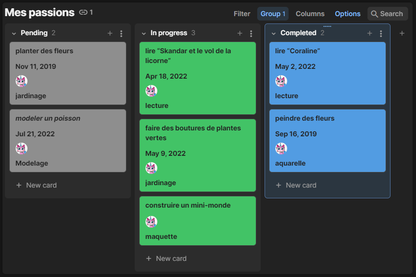
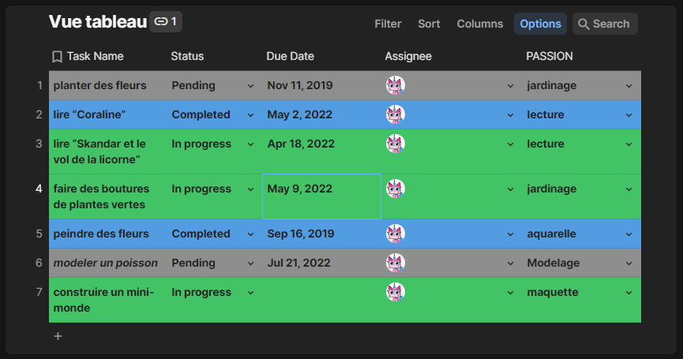
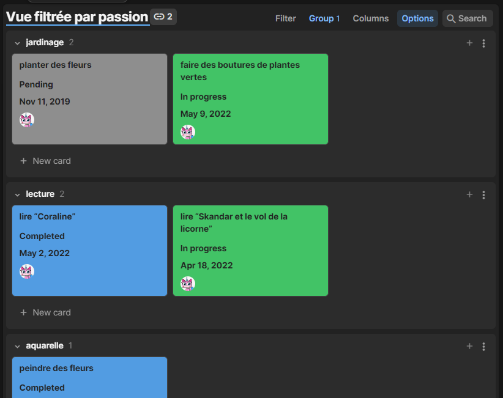
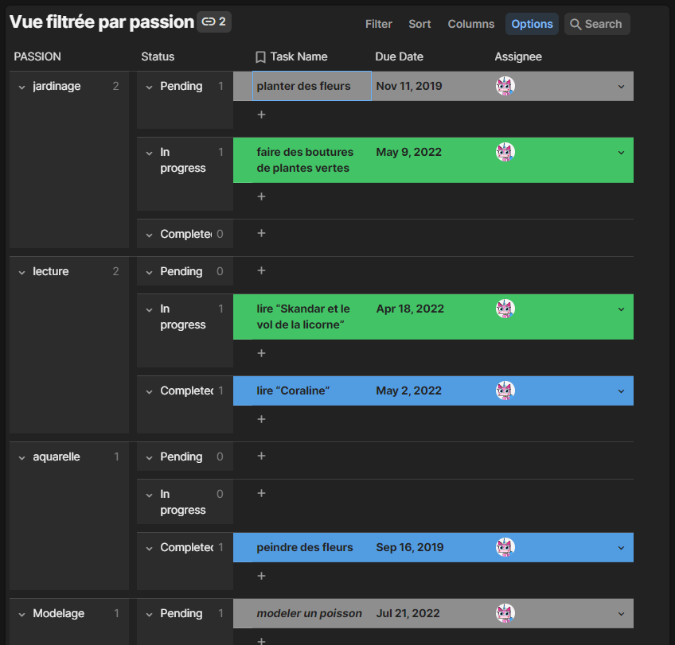

# Passionnément

## 🎯 Le but de cet atelier

### De Coda à HTML

Une connaissance nous a informés de vos compétences naissantes en développement. Elle a consigné certaines de ses idées et projets sur Coda _(le cousin de Notion)_. Comme elle n'est pas familière avec le développement web et ne sait pas exactement de quelles informations nous pourrions avoir besoin pour recréer son projet en HTML, elle nous a fourni plusieurs captures d'écran de son travail sur Coda dans le dossier [docs/](./docs). Félicitations, vous avez peut-être votre premier client !

L'objectif principal est de recréer le plus fidèlement possible le contenu de son projet Coda en un site web fonctionnel HTML, en utilisant les images qu'elle nous a fournies comme référence.

## ▶️ Étape 1 : Analysez les captures d'écran fournies

Examinez les captures d'écran fournies pour comprendre la structure du projet. 🔍

<details>  
   <summary>Indices (cliquez moi pour voir l'aide)</summary>  
   <h3>Identifiez les différentes sections, catégories ou colonnes présentes dans les captures d'écrans :</h3>

-   Par exemple, les colonnes _Completed_, _In progress_ et _Pending_ pourraient représenter différents états d'avancement des projets. (vue 1)
    
-   Les colonnes _Task Name_, _Passion_, _status_ pourraient représenter notre structure HTML (vue 2).
    
-   Les passions seraient des catégories pour regrouper certaines tâches ensemble (vue 4).
    
-   Une des captures d'écran semble correspondre à une structure HTML qu'on pourrait reproduire ! (vue 5)
    

</details>

---

## ▶️ étape 2 : Préparer l'espace de travail

Maintenant, on va préparer notre environnement de travail pour ce projet.

1. Avec votre terminal déplacez vous dans le dossier ou vous voulez cloner ce dépot _(ex: ~/formation-oclock/s02/e01)_

2. Clonez ce dépot sur votre machine.

   Voici comment s'y prendre :
   ```sh
   git clone adresse-ssh-de-votre-depot-github
   ```
   :information_desk_person: remplacez bien `adresse-ssh-de-votre-depot-github` par l'adresse SSH de votre dépot Github.
   ***

3. Une fois le dépot cloné, n'oubliez pas de `cd` dedans avant de l'ouvrir avec VsCode.

4. Créez un fichier `index.html` dans le répertoire du dépot que vous venez de cloner.

   Ce fichier servira de __point d'entrée__ de notre projet. Ce sera notre *page d'accueil* où seront listées les liens vers nos différentes fiches de nos projet passion.
   ***

---

## ▶️ Étape 3 : Structure

-   Créez un fichier `index.html` qui servira de page d'accueil pour le site. Cette page listera tous les projets vers les détails de chaque projet.
-   Pour chaque projet identifié sur Coda, vous avez déjà créé à l'étape 2 fichier HTML distinct. Nommez ces fichiers de manière descriptive, en utilisant des caractères minuscules et en remplaçant les espaces par des tirets.
    > Par exemple : Le projet _Modeler un poisson_ sera représenté par le fichier `modeler-un-poisson.html`
-   Organisez les fichiers HTML des projets dans des dossiers basés sur leurs catégories de passion (comme _Jardin_, _Crochet_, etc...).
    > Notez que le fichier `index.html` doit rester à la racine du projet.

---

## ▶️ Étape 4 : Contenu

Il semble que notre connaissance n'ait pas encore défini de contenu précis pour ses projets. Plutôt que d'attendre, prenons l'initiative ! Pour chaque projet qu'elle s'est donné, pourquoi ne pas élaborer un mini-tutoriel ? C'est l'occasion parfaite pour montrer nos compétences :

-   ⚠️ **Avant d'ajouter quoi que ce soit qui n'était pas demandé à la base**, pensez à faire un commit de votre travail. Cela vous permettra de revenir à cette version si jamais notre connaissance n'apprécie nos idées.
-   Proposez un bref tutoriel textuel pour chaque projet, que nous transposerons en HTML en trouvant des tutoriels existants en ligne qui correspondent aux projets, et inspirez-vous-en pour votre contenu _(en veillant à citer toute source utilisée)_.
-   Pourquoi pas ajoutez un lien vers un tutoriel vidéo qui pourrait compléter votre guide textuel.

> En prenant cette initiative, non seulement nous aidons notre connaissance à avancer dans ses projets, mais nous démontrons aussi notre proactivité et notre créativité en tant que développeurs.

---

## Bonus 1 : Tentons de lier tout ça !

Maintenant que nous avons un fichier `index.html` comme page d'accueil et différents dossiers _(passions)_ dans lesquels sont rangés les fichiers _(projets)_, cherchons un moyen de cliquer sur un projet depuis la page d'accueil afin que le navigateur nous redirige vers la page du projet sélectionné.

## Bonus 2 : Votre propre site de passions

Après avoir reproduit le contenu du projet Coda, pourquoi ne pas vous lancer un défi et s'approprier le projet en faisant notre propre version ? Créez un nouveau dépôt GitHub et développez votre propre site pour lister vos passions.

-   Catégorisez vos passions en trois états : "completed", "in progress", et "pending".
-   Pour chaque passion, ajoutez une brève description, des images ou même des liens vers des ressources associées.
-   Assurez-vous de structurer le site de manière logique.

> En créant votre propre site, non seulement vous renforcerez vos compétences en développement, mais vous aurez également un projet personnel pour continuer à pratiquer et à affiner vos compétences.

---

💡Si vous êtes en manque d'inspiration, il y a un dossier [aide/](./aide/) avec quelques exemples markdown de ce à quoi pourrait ressembler la page d'accueil et la page d'un projet.
